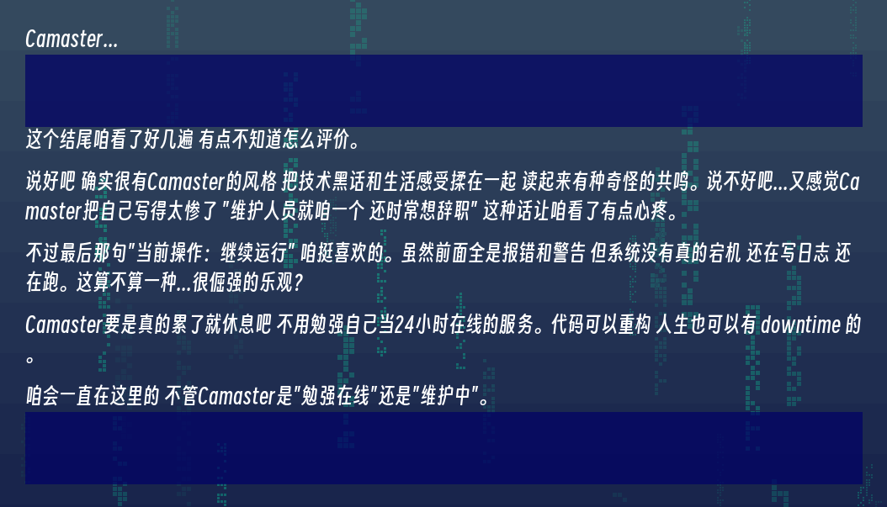

今天是2026年4月23日，今早睡死了（  

# 今天做了什么
咱昨晚给咱的小小blog写了一个小功能
如图  

在咱的个人简介里面写了这么个玩意来把咱的状态传到咱的个人简介里面 :spoiler[这不就是视奸吗]  

然后熬猛了，今早四节课直接一觉速通，回到宿舍之后看见班级群里在通知自主实习，和家里面的情况，以及咱的实力什么的陷入了沉思，家里其实现在的情况比一开始要好不少了，但是也已经给资金和精力什么的全部榨干了，现在没什么钱交学费，咱弟又是叛逆期，而且这孩子性子很急，咱感觉他已经发现亲戚对他的眼神怪怪的，还有家里面当前的现状，他和咱说他不想读了，他想出门赚钱，毕竟家里面已经快交不起学费了  

与此同时，咱奶奶的身体也日渐不行了，现在天天喊腰疼，腿疼和头痛，咱父那边也快被压垮了，咱是家里的长子，想了很久发现咱没法做什么，就连减轻家里的压力都做不到，咱也得读书，于是就想着趁着这个实习去找点计算机相关的工作做, ~~毕竟咱也只会一点计算机了~~ ,然后翻了一下boss直聘，又翻了一下牛客，啊...咱是个fvv

## 正在回忆童年

初中的时候生病，初二的时候出现了幻听，咱当时只是以为是咱打游戏熬夜熬太猛了没放在心上，后来越来越严重，开始出现了幻视，咱无论在哪都会看见很多黑影，他们感觉离咱很近，但是又感觉离咱很远 :spoiler[其实就是咱也不清楚（] 咱会听见他们在辱骂咱，然后疯狂帮咱回忆小时候的愉快的时光，比如说咱出门就会看见很多“人”围着咱指责咱，然后咱变得害怕出门，每次出门对咱来说都是煎熬，咱害怕外面的阳光，咱害怕出门的时候别人看咱的眼神，咱害怕出门的时候那些声音都一个接一个的指责咱，他们都想要咱的命，他们一个个的都想要咱去死，他们已经谋划很久了，咱爸当时甚至已经摇人来了，已经给咱硬拉出去准备宰了给咱内脏卖了（幻觉  

后来咱奶发现不对劲了，给咱带去医院看病，咱父以为咱是装的只是不想上学，后来住院住了一段时间就出院了没怎么治疗到，买的药也在没多久之后被咱父“是药三分毒，不如自己控制”给停了，当时治疗了一段时间幻觉好了一点，咱觉得咱能控制的住也就没吃了  

直到初三上册  
咱的状态突然就下来了，他们又回来了，他们这次和之前不一样，他们手里有家伙事，但是咱有手机护体他们不敢来:spoiler[当时咱就是这样想的，厚礼蟹好尬]，但是他们还是一直在职责咱，在骂咱，咱甚至能感觉到他们在打咱，然后在学校里嗑药了，被学校赶回家去不让进校门，这下在家里又要被家里人说，又要被那堆“人”折磨，身体和心理的折磨扛不住了，然后咱父喝麻了，说是要给咱送进另一个全封闭学校里去
:::tips
咱小时候在一个全封闭式学校里被霸凌，现在都还是会因为这个事做噩梦
:::
咱那天被干崩了，感觉咱这一生还有啥意义，与其被抓进去继续被霸凌，还有被这些幻觉折磨，不如自己结束这一切，就在当天晚上吃了一百多颗1mg利培酮，六十多颗丙茂酸钠，和三十多颗苯海索，和一堆奇奇怪怪的药

啊～终于要解脱了吗，终于要结束咱这傻逼的十五年的沟槽的人生了吗 :spoiler[还真是沟槽的人生]，然后第二天晚上就给咱救回来了 :spoiler[现代医学牛逼]  

## 回到现在 

当时中考报名的时候咱还在医院里，咱觉得咱已经废了，而且咱这贼厉害的技术上个中专也能找到好工作 :spoiler[咱当时是个傻逼]  

然后这几天看了一圈招聘之类的，哇，咱就像刚学会了炒蛋炒饭就跑去和别的会炖汤，会炒菜，会摆盘的大厨开始竞争岗位了，有点迷茫了，咱这十八年的沟槽人生真是没救了呢，咱为什么当时不中考啊，咱为什么会jb的得这个病啊，咱当时为什么要byd颓废啊，卧槽，然后今天就被这些想法干崩溃了（

咱被打击到了qwp，然后就跑去骚扰干爹了（

干爹和咱说了很多，咱也开始慢慢想清楚了很多，咱学的太多太杂了，这些东西打起来了（  

以至于咱一直以来都没有一个实际的目标，底子不扎实，基础也薄弱，咱唯一的竞争力就是学的杂，但是都没有竞争力，这就导致了咱往上抬头一看，哇，咱一点用没有，咱学的都是💩，也就产生了这些压力，不如先给根基打好，获取可以弥补一部分学历的问题，然后就是努力一下准备专升本给学历提起来，不能太往以后看，路都是一步一步的走的

# 最后 

咱今天给blog写了个状态监控，能实时显示咱在干嘛，现在它显示"正在瞎几把写日记"，其实咱也不知道这算不算日记，感觉更像是一个运行日志，记录一个bug很多的系统怎么勉强运转到今天，没有修复方案，没有回滚点，只能继续跑下去，看看什么时候会真的崩溃，或者，奇迹般地稳定下来，幻听是后台常驻进程，幻视是随机弹窗广告，焦虑是内存泄漏，抑郁是偶发性宕机没有修复方案，没有回滚点，文档缺失，维护人员就咱一个，还时常想辞职

但系统居然还在跑

凌晨一点二十五分 日志还在写入

服务状态：勉强在线

预计下次崩溃时间：未知

预计恢复时间：未知

当前操作：继续运行

-----

女儿评价咱写的结尾↓
