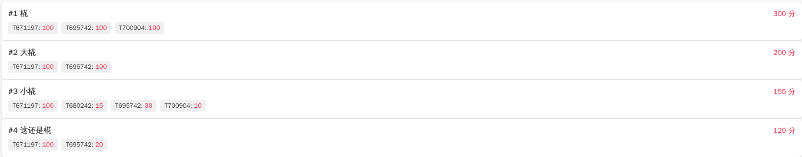
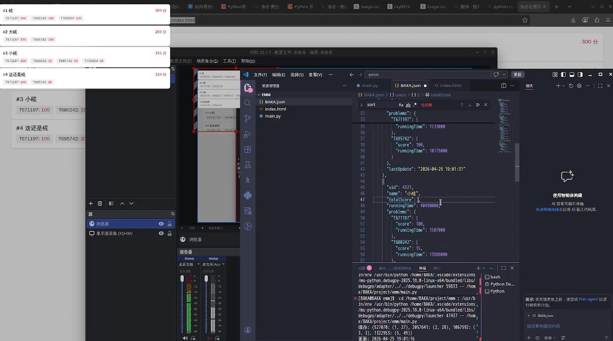

今天闲来无事，突然想起来干爹之前说想写一个cf滚榜，然后咱想着闲着也是闲着就写了个洛谷的

先说一下咱的思路
 ```mermaid
graph TD
    A[咱 Arch 电脑] --> B[使用py抓取洛谷比赛排行榜json]
    B -->C[将抓取到的json简单改一下格式塞进本地json]
    C --> E[使用前端进行展示和滚榜功能]
 ```

 ## 抓取数据  
 咱想了很多种滚榜方式，比如
 - 获取全部排行榜，然后直接对这个总榜进行更改 --> 优点是展示的很全，所有人都能展示出来；缺点是如果人很多则会导致很慢
 - 只获取五个，前后各两个，自己在中间 --> 优点是对于只查询自己的情况速度会快不少，如果有多个人也可考虑使用这个方式；缺点是获取数据的时候会稍微有一点麻烦（也可能是咱太菜了）
 - 只查询特定人员，然后在这些人里面进行滚榜 --> 优点是对于《小团体》来说完全够用，比如说朋友间《切磋》之类的；缺点也很明显，他只能查这几个人的数据

咱选择了最后一个方式，因为咱是蒟蒻，写不出太高深的东西（（（

先来看一下代码
~~~
import requests
import json
import time
from datetime import datetime

url_id =  # 目标比赛id喵
uids = [用户id1,用户id2] # 目标用户id喵
cookies = { # 下面填成你的喵
    "__client_id": "你的__client_id喵",
    "_uid": "你的_uid喵",
    "C3VK": "你的C3VK喵",
}

position_cache = {}

def main():
    build_cache(url_id, uids, cookies)
    print(f"缓存: {position_cache}")
    
    while True:
        result = fetch_by_cache(url_id, uids, cookies)
        write_data(url_id, result)
        print(f"更新: {result['updateTime']}")
        time.sleep(10)

def fetch_page(url_id, page, headers, cookie):
    baseurl = f"https://www.luogu.com.cn/fe/api/contest/scoreboard/{url_id}?page={page}"
    try:
        response = requests.get(baseurl, headers=headers, cookies=cookie, timeout=30)
        if response.status_code == 200:
            return response.json()
        return None
    except Exception as e:
        print(f'第{page}页异常: {e}')
        return None

def build_cache(url_id, target_uids, cookie):
    headers = {
        'User-Agent': 'Mozilla/5.0 (Windows NT 10.0; Win64; x64) AppleWebKit/537.36',
        'Accept': 'application/json, text/plain, */*',
        'Accept-Language': 'zh-CN,zh;q=0.9',
        'Referer': f'https://www.luogu.com.cn/contest/{url_id}',
        'X-Requested-With': 'XMLHttpRequest',
    }

    data = fetch_page(url_id, 1, headers, cookie)
    if data is None:
        return
    
    scoreboard = data.get('scoreboard', {})
    per_page = scoreboard.get('perPage', 50)
    total_count = scoreboard.get('count', 0)
    total_pages = (total_count - 1) // per_page + 1
    
    remaining = set(target_uids)
    
    for i, row in enumerate(scoreboard.get('result', [])):
        uid = row['user']['uid']
        if uid in remaining:
            position_cache[uid] = (1, i)
            remaining.remove(uid)
    
    for page_num in range(2, total_pages + 1):
        if not remaining:
            break
            
        page_data = fetch_page(url_id, page_num, headers, cookie)
        if page_data is None:
            continue
        
        for i, row in enumerate(page_data.get('scoreboard', {}).get('result', [])):
            uid = row['user']['uid']
            if uid in remaining:
                position_cache[uid] = (page_num, i)
                remaining.remove(uid)

def fetch_by_cache(url_id, target_uids, cookie):
    headers = {
        'User-Agent': 'Mozilla/5.0 (Windows NT 10.0; Win64; x64) AppleWebKit/537.36',
        'Accept': 'application/json, text/plain, */*',
        'Accept-Language': 'zh-CN,zh;q=0.9',
        'Referer': f'https://www.luogu.com.cn/contest/{url_id}',
        'X-Requested-With': 'XMLHttpRequest',
    }

    all_users = []
    pages_to_fetch = set()
    
    for uid in target_uids:
        if uid in position_cache:
            pages_to_fetch.add(position_cache[uid][0])
    
    page_data_cache = {}
    for page_num in pages_to_fetch:
        page_data_cache[page_num] = fetch_page(url_id, page_num, headers, cookie)
    
    for uid in target_uids:
        if uid not in position_cache:
            continue
        
        page_num, local_index = position_cache[uid]
        page_data = page_data_cache.get(page_num)
        
        if page_data is None:# Camellia
            continue
        
        rows = page_data.get('scoreboard', {}).get('result', [])
        if local_index >= len(rows):
            continue
        
        row = rows[local_index]
        if row['user']['uid'] == uid:
            # 处理每道题的分数
            problems = {}
            for pid, detail in row.get('details', {}).items():
                problems[pid] = {
                    'score': detail.get('score', 0),
                    'runningTime': detail.get('runningTime', 0)
                }
            
            all_users.append({
                'uid': row['user']['uid'],
                'name': row['user']['name'],
                'totalScore': row['score'],
                'runningTime': row['runningTime'],
                'problems': problems,
                'lastUpdate': datetime.now().strftime('%Y-%m-%d %H:%M:%S')
            })
    
    # all_users.sort(key=lambda x: (-x['totalScore'], x['runningTime']))
    
    return {
        'totalUsers': len(target_uids),
        'foundUsers': len(all_users),
        'updateTime': datetime.now().strftime('%Y-%m-%d %H:%M:%S'),
        'users': all_users
    }

def write_data(url_id, data):
    with open(f'BAKA.json', 'w', encoding='utf-8') as f:
        json.dump(data, f, ensure_ascii=False, indent=2)

if __name__ == "__main__":
    main()

~~~

原理很简单，首先先给排行榜全部遍历一遍找到要查的人，然后保存他们的页面和位置，然后创建BAKA.json给“查询总人数”，“最后修改json时间”，“各个用户的信息”塞进去

一开始是打算弄完之后给他们进行排序然后前端直接滚，然后后来发现，不如直接前端来弄来的实在

urlid直接在你要查询的比赛那里看就好了，就内个比赛编号  
uids就直接放你要查的那些人的用户id
cookies就去```https://www.luogu.com.cn/fe/api/contest/scoreboard/比赛编号?page=1```里面打开控制台找

然后运行就能给在代码同等目录之下创建BAKA.json,并且自动给数据塞进去  
  
belike↓
~~~
{
  "totalUsers": 4,
  "foundUsers": 4,
  "updateTime": "2026-04-25 19:01:31",
  "users": [
    {
      "uid": 11451,
      "name": "椛",
      "totalScore": 300,
      "runningTime": 23496000,
      "problems": {
        "T671197": {
          "score": 100,
          "runningTime": 546000
        },
        "T695742": {
          "score": 100,
          "runningTime": 13445000
        },
        "T700904": {
          "score": 100,
          "runningTime": 9505000
        }
      },
      "lastUpdate": "2026-04-25 19:01:31"
    },
    {
      "uid": 12345,
      "name": "大椛",
      "totalScore": 200,
      "runningTime": 11908000,
      "problems": {
        "T671197": {
          "score": 100,
          "runningTime": 1733000
        },
        "T695742": {
          "score": 100,
          "runningTime": 10175000
        }
      },
      "lastUpdate": "2026-04-25 19:01:31"
    },
    {
      "uid": 4321,
      "name": "小椛",
      "totalScore": 155,
      "runningTime": 40490000,
      "problems": {
        "T671197": {
          "score": 100,
          "runningTime": 1507000
        },
        "T680242": {
          "score": 15,
          "runningTime": 13888000
        },
        "T695742": {
          "score": 30,
          "runningTime": 13262000
        },
        "T700904": {
          "score": 10,
          "runningTime": 11833000
        }
      },
      "lastUpdate": "2026-04-25 19:01:31"
    },
    {
      "uid": 2134,
      "name": "这还是椛",
      "totalScore": 120,
      "runningTime": 4109000,
      "problems": {
        "T671197": {
          "score": 100,
          "runningTime": 989000
        },
        "T695742": {
          "score": 20,
          "runningTime": 3120000
        }
      },
      "lastUpdate": "2026-04-25 19:01:31"
    }
  ]
}
~~~

## 前端展示和滚榜
先上代码
~~~
<!DOCTYPE html>
<html lang="zh-CN">
<head>
    <meta charset="UTF-8">
    <meta name="viewport" content="width=device-width, initial-scale=1.0">
    <title>BIG BAKA</title>
    <style>
        * {
            margin: 0;
            padding: 0;
            box-sizing: border-box;
        }
        
        body {
            background: #f5f5f5;
            color: #333;
            font-family: 'Microsoft YaHei', sans-serif;
            padding: 20px;
        }
        
        #userList {
            position: relative;
            height: 100vh;
        }
        
        .user-card {
            background: #fff;
            border-radius: 8px;
            padding: 15px;
            margin-bottom: 10px;
            box-shadow: 0 2px 4px rgba(0,0,0,0.1);
            transition: all 0.5s ease;
            position: absolute;
            width: calc(100% - 40px);
            left: 20px;
        }
        
        .user-header {
            display: flex;
            justify-content: space-between;
            align-items: center;
            margin-bottom: 8px;
        }
        
        .user-name {
            font-size: 1.1em;
            font-weight: bold;
        }
        
        .user-score {
            color: #e94560;
            font-weight: bold;
        }
        
        .problems {
            display: flex;
            gap: 8px;
            flex-wrap: wrap;
        }
        
        .problem {
            background: #f0f0f0;
            padding: 4px 10px;
            border-radius: 4px;
            font-size: 0.9em;
        }
        
        .problem-score {
            color: #e94560;
            font-weight: bold;
        }
    </style>
</head>
<body>
    <div id="userList"></div>

    <script>
        let currentUsers = [];
        const cardHeight = 90;
        
        async function loadData() {
            try {
                const response = await fetch('BAKA.json');
                const data = await response.json();
                
                const sortedUsers = [...data.users].sort((a, b) => {
                    if (b.totalScore !== a.totalScore) {
                        return b.totalScore - a.totalScore;
                    }
                    return a.runningTime - b.runningTime;
                });
                
                updateDisplay(sortedUsers);
                
            } catch (error) {
                console.error('加载失败:', error);
            }
        }
        
        function updateDisplay(newUsers) {
            const container = document.getElementById('userList');
            
            if (currentUsers.length === 0) {
                container.innerHTML = '';
                newUsers.forEach((user, index) => {
                    const card = createCard(user, index);
                    container.appendChild(card);
                });
                currentUsers = newUsers;
                return;
            }
            
            newUsers.forEach((user, newIndex) => {
                let card = document.getElementById('card-' + user.uid);
                
                if (!card) {
                    card = createCard(user, newIndex);
                    container.appendChild(card);
                }
                
                card.style.top = (newIndex * cardHeight) + 'px';
                updateCardContent(card, user, newIndex);
            });
            
            currentUsers.forEach(user => {
                if (!newUsers.find(u => u.uid === user.uid)) {
                    const card = document.getElementById('card-' + user.uid);
                    if (card) card.remove();
                }
            });
            
            currentUsers = newUsers;
        }
        
        function createCard(user, index) {
            const div = document.createElement('div');
            div.id = 'card-' + user.uid;
            div.className = 'user-card';
            div.style.top = (index * cardHeight) + 'px';
            div.innerHTML = getCardHtml(user, index);
            return div;
        }
        
        function updateCardContent(card, user, index) {
            card.innerHTML = getCardHtml(user, index);
        }
        
        function getCardHtml(user, index) {
            re  turn `
                <div class="user-header">
                    <div>
                        <span class="user-name">#${index + 1} ${user.name}</span>
                    </div>
                    <div class="user-score">${user.totalScore} 分</div>
                </div>
                <div class="problems">
                    ${Object.entries(user.problems).map(([pid, p]) => `
                        <div class="problem">
                            ${pid}: <span class="problem-score">${p.score}</span>
                        </div>
                    `).join('')}
                </div>
            `;
        }
        
        loadData();
        setInterval(loadData, 5000);
    </script>
</body>
</html>
~~~

用的老三样

html,css,js

这一块咱就写了一下逻辑就给美化交给咱亲爱的大女儿了，主要内容也就解析BAKA.json,然后给内容解析，之后进行展示与滚榜

## 总结

咱的这坨大粪咱删删改改改了六个版本（py爬虫那个）真用不习惯py，咱的cpp写法正在攻击咱的py写法，最终写了依托大的拿出来了，wow，咱的史真好吃 :spoiler[还有自产自销？？！]

后面前端倒是轻松的多，写完逻辑啥的之后就直接交给咱女儿美化了，放一下实机图

如果要直播什么的直接用obs抓取之后就会正常很多

